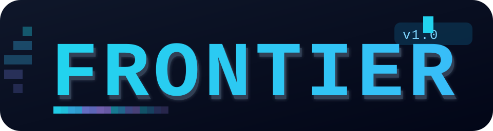

# Frontier

Frontier is a **command-line build discipline for AI coding**: one stdlib-only Python
file that makes an AI agent (or several) produce **correct-context, verified,
collision-free** work in any repo — with the human as orchestrator. No daemon, no
database, no server. Everything is plain files under `.agents/`, and a 24-check
`selftest` proves the tool works before you trust it.



[](https://www.python.org)
[](https://docs.python.org/3/library/)
[]()
[](https://github.com/shahmanager/frontier/actions)
[](LICENSE)
[](scripts/frontier.py)
[](scripts/frontier.py)

---

## Documentation quick links

- [Installation](#installation)
- [Command reference](docs/COMMANDS.md) — every command, syntax, real output
- [User guide](SKILL.md) — the full discipline, 14 sections
- [Frequently asked questions](#faq)
- [Setup guide](references/INSTALL.md)
- [Comparing to other tools](#comparing-to-other-tools)

**TL;DR** — the whole pitch in one block and one bench row:

```bash
python scripts/frontier.py init .          # scaffold router + task templates
python scripts/frontier.py selftest        # 24-check proof, exit 0 = trust it
python scripts/frontier.py bench           # compact: 159 -> 7 lines (~1 ms), keeps 4%
```

Agents fail on large codebases the same ways every time: **bloated context, recency
bias, no proof, stale parallel reads, chat loops.** Each failure below is fixed by one
command, and every command is verifiable — that's the entire tool.

| Failure | Frontier command that fixes it |
|---|---|
| Context bloat / recency bias | `compact` — keyword-scored, **never newest-first** |
| No proof on the merge SHA | `evidence` + `validate` ready-gate (exit-0 receipt bound to SHA) |
| Stale reads in parallel work | `drift` — scope fingerprint, exit 1 when files moved |
| Colliding parallel edits | `lease` — disjoint scopes run parallel, overlap blocks |
| Infinite chat loops, no stop rule | `lease release` (`done` broadcast) · `lease noop` (liveness) |
| Stuck, no path up | `lease escalate` |
| Repeating known mistakes | `recall` — tier-0 retrieval over `LEARNINGS.md` |
| Rubber-stamp reviews | `review` — diff-risk checklist |
| Cold restart after `/clear` | `resume` — leases + signals + broadcasts rebuilt |
| Wrong skill loaded | `suggest` — registry trigger match |
| Over-engineering / rambling | ladder + caveman-lite output (built in, see FAQ) |
| Forgotten handoff format | `handoff` — skeleton + real git SHA |

---

## Installation

No dependencies. Python 3.9+, works Windows/macOS/Linux. Two modes:

**A) Repo-local scaffold (the agent's environment).** Copy the file anywhere, run from
your repo root:

```bash
cd <your-repo>
python scripts/frontier.py init .          # scaffold: AGENTS.md, docs/, .agents/, memory/
python scripts/frontier.py validate        # expect: frontier handoff OK
```

**B) System-wide CLI (optional).**

```bash
pip install .          # or: uvx frontier-ai
frontier.py selftest   # 24-check proof, repo-wide
```

**C) Make your agent auto-load it.** Drop `SKILL.md` where your agent reads AGENTS.md,
or paste `references/INSTALL.md` §2 into your agent prompt — done.

10-second demo of what `init` builds:

```
frontier init OK: 9 created, 0 skipped -> .
Next: fill AGENTS.md [brackets], run `codegraph init` if available.
```

---

## Command reference

Full reference with exact syntax, arguments, exit codes and real output is in
**[docs/COMMANDS.md](docs/COMMANDS.md)**. Summary table:

| Command | Syntax (abridged) | What it does |
|---|---|---|
| `init` | `init [dir]` | Scaffold router + task templates into a repo, never overwrites |
| `suggest` | `suggest <task text>` | Which skills to load, from registry triggers |
| `recall` | `recall <words>` | Top-5 past `LEARNINGS.md` lines by overlap |
| `compact` | `compact IN OUT TASK` | Context prune, keyword-scored, no recency bias |
| `ctx` | `ctx <symbol>` | CodeGraph explore → `.codegraph/ctx.md`; SKIP if absent |
| `lease*` | 10 subcommands (below) | Multi-agent coordination: leases, signals, locks |
| `drift` | `drift TASK AGENT` | Exit 1 if scope files changed since acquire |
| `evidence` | `evidence TASK -- CMD` | Bind exit code to git SHA receipt |
| `validate` | `validate [tasks_dir]` | Read-only gate: frontmatter, budget, secrets, evidence |
| `review` | `review` | Diff-risk checklist for the human reviewer |
| `resume` | `resume AGENT` | Rebuild leases + signals + broadcasts after `/clear` |
| `handoff` | `handoff TASK.md` | Print handoff skeleton with real SHA |
| `doctor` | `doctor` | Machine health check |
| `selftest` | `selftest` | 24-check end-to-end proof (also your CI) |
| `bench` | `bench` | Measure compact/recall/lease/drift on this machine |

`lease` subcommands: `acquire [--force] [--ttl N] | release | heartbeat | signal |
escalate | noop | lock | unlock | status | list`.

---

## Why should I use Frontier?

- **It replaces several tools you're running today.** If you currently glue together
  ponytail (ladder), caveman (terse output), a context compactor, and hand-rolled
  parallelism, Frontier ships those as one auditable file. See [FAQ](#faq).
- **Provable, not vibe.** `selftest` exercises every mechanism in a temp dir and exits
  non-zero if any breaks. `bench` prints real numbers. Your CI runs both.
- **Zero footprint.** No daemon, no DB, no server, no deps. Plain JSON files you can
  `git` / `cat` / delete. Survives `/clear` because it lives on disk, not in context.
- **Human stays in charge.** Leases, reviews, escalations and releases all route
  through a human-orchestrated loop. Agents coordinate; the human gates merges.
- **Degrades gracefully.** No codegraph? `ctx` prints one line and moves on. Solo
  task? Skip `lease` — the rest works alone.

## Why shouldn't I use Frontier?

- You're **already on a real orchestration platform** (Task/Bureau/STORM) and want
  that platform's runtime to handle concurrency — Frontier's leases are the *lock
  protocol* they'd replace, not an improvement over proper infra at scale.
- You **need semantic memory**, not keyword retrieval — bring claude-mem/agentmemory as
  your tier-1+; Frontier's `recall` is deliberately the cheap tier-0.
- You want a **UI/dashboard** — Frontier is a CLI and plain files, on purpose.
- Your repo/context state is **never a problem** and you **never run agents in
  parallel** — you'll use maybe two of the fifteen commands. The rest is optional.

---

## FAQ

### With Frontier, do I still need ponytail and caveman?

**No — Frontier absorbs them.** That's a deliberate design decision, and it's the answer
to the most common confusion:

- **ponytail** → its minimal-diff ladder is `references/ladder.md` (§1 of SKILL.md).
  The 7 rungs, the root-cause rule, the one-check rule — all built in.
- **caveman** → its output discipline (code first, then ≤3 lines, no filler) is
  `references/output.md` (§3 of SKILL.md), always on.

There's no harm in keeping them installed — they're separate skills that *also* load
when their triggers fire. But **nothing you do with Frontier requires them.** Frontier
vendored the parts that matter. The one thing it does *not* take is every niche output
mode (wenyan styles etc.) — if you want those, you keep caveman for the flavor; for
coding output, Frontier's is active by default.

### What about codegraph?

**Frontier wraps codegraph, doesn't replace it.** `ctx` shells out to it and writes
`.codegraph/ctx.md`; if it's absent you get `SKIP` on one line. Install it
(`npm i -g @codegraph/cli && codegraph init`) only if you want semantic cross-file
navigation.

### What about agent memory (claude-mem / agentmemory / mem0)?

**Frontier's `recall` is tier-0 only — the cheap 5%.** Word-overlap over
`LEARNINGS.md` and `memory/*.md`, no server. On real projects you layer a tier-1+
memory server *above* it; `recall` remains compatible because it's additive, not
exclusive.

### What about a multi-agent orchestrator?

Frontier's `lease` protocol is exactly the **concurrency-control layer** an
orchestrator would provide, done as plain files so a human can orchestrate without
infra. If you outgrow it (spawning, retries, sandboxing), plug an orchestrator in on
top — the leases stay, as its lock protocol.

### Does Frontier run my tests?

No. It runs the command *you* give `evidence`, binds its exit code to SHA, and gates
on it. pytest/vitest/cargo stay your engines.

### Is `validate` destructive?

No. It only reads. Safe in CI.

### Multi-agent — how do I start?

```bash
python scripts/frontier.py lease acquire AUTH-1 agent-1 "src/auth/**" "tests/auth/**"
python scripts/frontier.py lease acquire AUTH-1 agent-2 "docs/**" "openapi/**"   # disjoint = parallel
python scripts/frontier.py lease signal AUTH-1 agent-1 agent-2 contracts_ready "v2 final"
python scripts/frontier.py lease release AUTH-1 agent-1   # broadcasts done
```

Overlapping scope attempt → `LEASE_HELD by <holder>` exit 1. That's the anti-collision
guarantee.

---

## Comparing to other tools

| Tool | What it is | Frontier's stance |
|---|---|---|
| ponytail | minimal-diff discipline | **absorbed** (`ladder.md`) |
| caveman | terse output discipline | **absorbed** (`output.md`) |
| codegraph | semantic code nav | **wrapped** (`ctx`), optional |
| claude-mem / agentmemory | tier-1+ memory servers | **deferred**, `recall` is the tier-0 above them |
| Task / Bureau / STORM | agent orchestration runtimes | **deferred**; leases = their lock protocol |
| agents.md / AGILE.md | static router specs | **scaffolded + gated + validated**, not just documented |
| gitleaks / trivy | security scanning | **deferred**; `validate` does a few secret regexes |
| pytest / vitest / cargo | test engines | **consumed** — `evidence` wraps their exit code |

**Rule:** absorb *opinions* (methods, text, cheap). Defer *tools* (install, compute,
servers). Frontier is a discipline spine, not a tool host.

---

## Proof & performance

### 24-check selftest (runs in CI)

Every mechanism exercised in a temp dir; any check failing → exit 1 → CI fails. Summary
of `PASS` lines: init, compact keep/drop, acquire, parallel disjoint, overlap blocked,
force coexistence, heartbeat, signal, escalate, noop, lock/unlock, drift detects,
recall finds, resume signals, review degrades, bench runs, evidence receipt,
ready-gate blocks, validate green.

### Bench (real numbers, this machine)

Reproduce with `python scripts/frontier.py bench`:

| bench | what was measured | result | ms avg |
|---|---|---|---|
| compact | 159-line log → 7 relevant lines | **4% kept** | ~1 |
| recall | tier-0 retrieval | top-5 hits | ~3 |
| lease acquire+fp | sha1 fingerprint of 200 files | 1 lease | ~80 |
| drift | re-fingerprint 200 files + compare | clean / exit1 | ~90 |

Figures are medians from a local run; fitness cost scales with scope file count —
that's the price of stale-read protection.

---

## Documentation

- [`docs/COMMANDS.md`](docs/COMMANDS.md) — full command reference (syntax, output, exit codes)
- [`SKILL.md`](SKILL.md) — the complete discipline
- [`references/INSTALL.md`](references/INSTALL.md) — paste-ready setup + agent prompt + migration from v2
- [`references/seek.md`](references/seek.md) — read-down order before coding
- [`references/ladder.md`](references/ladder.md) — minimal-diff ladder + debug loop + test-first
- [`references/output.md`](references/output.md) — caveman-lite output discipline
- [`references/TASK.md`](references/TASK.md) — task/plan template
- [`.agents/protocol/LEASE.md`](.agents/protocol/LEASE.md) — full multi-agent lease protocol

## Contributing

- A fix is code + `selftest` green + `validate` green. CI enforces both.
- A new command ships its own selftest check (see `cmd_selftest`).
- Stdlib only, by law. Keep it lazy: if the change adds more prose than code, delete the prose.

## License

MIT. Influences: Karpathy (behavior), Cherny (loop), ponytail (ladder), caveman (output).